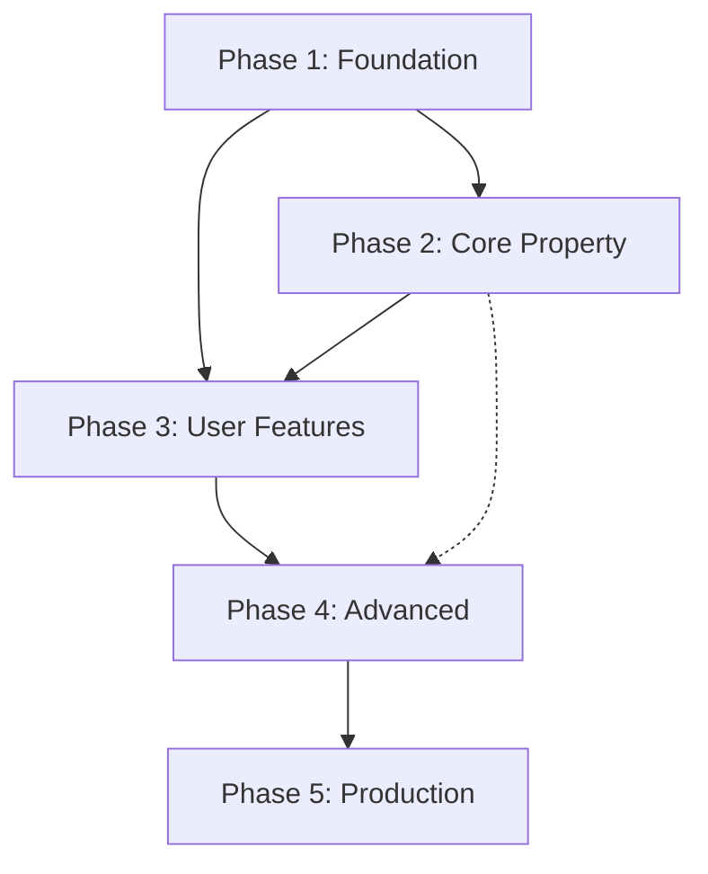

# 02 — 1Guntha Flutter Migration Plan

**Document version:** 1.0  
**Date:** 2026-06-10  
**Prerequisite:** `01_Project_Analysis.md`  
**Constraint:** Zero backend changes — consume existing APIs only

---

## Table of Contents

1. [Overview](#1-overview)
2. [Migration Principles](#2-migration-principles)
3. [Phase Summary](#3-phase-summary)
4. [Phase 1 — Foundation](#4-phase-1--foundation)
5. [Phase 2 — Core Property Features](#5-phase-2--core-property-features)
6. [Phase 3 — User Features](#6-phase-3--user-features)
7. [Phase 4 — Advanced Features](#7-phase-4--advanced-features)
8. [Phase 5 — Production Readiness](#8-phase-5--production-readiness)
9. [Dependency Graph](#9-dependency-graph)
10. [Team & Effort Summary](#10-team--effort-summary)
11. [Definition of Done (Per Phase)](#11-definition-of-done-per-phase)
12. [Approval Gate](#12-approval-gate)

---

## 1. Overview

This plan migrates the **1Guntha Angular web client** to a **production-ready Flutter mobile app** (Android + iOS) that talks to `https://1guntha.com/api`.

| Attribute | Value |
|-----------|-------|
| Target platforms | Android 8+ (API 26), iOS 14+ |
| Flutter channel | Stable |
| Architecture | Clean Architecture + Riverpod + GoRouter |
| API parity | 100% of Angular-used endpoints in Phases 1–3 |
| Enhanced mobile UX | Favorites tab, pull-to-refresh, infinite scroll |

**Total estimated effort:** 14–18 weeks (1 senior Flutter engineer, full-time)

---

## 2. Migration Principles

1. **API-first** — Every screen maps to an existing Angular API call before UI polish.
2. **One feature at a time** — Complete data → domain → presentation per feature before moving on.
3. **No backend changes** — If Angular doesn't call it, don't assume it works; if backend has unused API, document and test first.
4. **Parity before enhancement** — Match Angular behavior; mobile UX improvements (bottom nav, sheets) are presentation-only.
5. **Incremental codegen** — `freezed` + `json_serializable` per feature; run `build_runner` scoped to changed files.
6. **Never rewrite working code** — Extend, don't replace, once a feature passes QA.

---

## 3. Phase Summary

| Phase | Name | Duration | Outcome |
|-------|------|----------|---------|
| **1** | Foundation | 2–3 weeks | Runnable app shell, auth, theme, networking |
| **2** | Core Property | 3–4 weeks | Home, search, detail, favorites, gallery |
| **3** | User Features | 3–4 weeks | Dashboard, profile, my properties, list property, visits |
| **4** | Advanced Features | 3–4 weeks | Agent, blog, admin, blog studio |
| **5** | Production Readiness | 2–3 weeks | Analytics, crashlytics, CI/CD, store release |

---

## 4. Phase 1 — Foundation

### Scope

Project bootstrap, design system, networking layer, authentication, and navigation shell.

### Tasks

| # | Task | Details |
|---|------|---------|
| 1.1 | Create Flutter project `1G-Mobile` | `flutter create`, org `com.oneguntha`, flavors dev/prod |
| 1.2 | Folder structure | Per `03_Flutter_Architecture.md` |
| 1.3 | Dependencies | riverpod, dio, go_router, freezed, json_serializable, flutter_secure_storage, cached_network_image, flutter_dotenv |
| 1.4 | Theme system | Material 3 light/dark from Angular CSS tokens |
| 1.5 | Typography | Google Fonts: DM Sans + Space Grotesk |
| 1.6 | App config | `apiBaseUrl = https://1guntha.com/api` per flavor |
| 1.7 | Dio client | Base options, timeouts, logging (dev only) |
| 1.8 | Auth interceptor | Bearer token attach |
| 1.9 | Refresh interceptor | 401 → `/auth/refresh` → retry (match Angular) |
| 1.10 | Error interceptor | Map to `AppException`, user-facing messages |
| 1.11 | Secure storage | Token + user JSON persistence |
| 1.12 | Auth models | `User`, `AuthResponse`, `SignupResponse`, freezed |
| 1.13 | Auth repository | login, signup, verify-signup, resend-otp, refresh, logout |
| 1.14 | Auth providers | `authStateProvider`, `isLoggedInProvider`, `userRoleProvider` |
| 1.15 | GoRouter setup | Shell route with bottom nav placeholder |
| 1.16 | Login screen | Form validation parity |
| 1.17 | Signup screen | Redirect to OTP with pending state |
| 1.18 | OTP verification screen | 6-digit input, resend throttling UI |
| 1.19 | Forgot password screen | Two-step: email → OTP + password |
| 1.20 | Splash screen | Check stored session → home or login |
| 1.21 | Route guards | Redirect logic matching Angular guards |
| 1.22 | Shared widgets | `AppButton`, `AppTextField`, `AppScaffold`, `LoadingOverlay`, `ErrorView`, `EmptyView` |
| 1.23 | Unit tests | Auth repository, interceptors, validators |

### Dependencies

- None (greenfield)
- Production API reachable for integration testing

### Estimated Effort

| Role | Days |
|------|------|
| Senior Flutter engineer | 12–15 |
| QA (manual auth flows) | 2 |

### Files Affected (New)

```
lib/
├── main.dart
├── main_dev.dart / main_prod.dart
├── config/env_config.dart
├── config/app_router.dart
├── core/network/dio_client.dart
├── core/network/interceptors/
├── core/storage/secure_storage_service.dart
├── core/theme/app_theme.dart
├── core/theme/app_colors.dart
├── core/theme/app_typography.dart
├── core/error/app_exception.dart
├── core/error/error_mapper.dart
├── shared/widgets/
├── features/auth/
│   ├── data/
│   ├── domain/
│   ├── application/
│   └── presentation/
└── pubspec.yaml
```

### Exit Criteria

- [ ] Login → dashboard with valid seed user
- [ ] Signup → OTP → auto-login
- [ ] Token refresh works after access token expiry
- [ ] Session cleared on refresh failure
- [ ] Forgot password E2E
- [ ] Dark mode toggle works
- [ ] `flutter analyze` clean

---

## 5. Phase 2 — Core Property Features

### Scope

Public property discovery — the primary user experience matching 99acres/Housing.com browse patterns.

### Tasks

| # | Task | Details |
|---|------|---------|
| 2.1 | Property models | `Property`, `PropertyImage`, `PageResponse`, enums |
| 2.2 | Carousel model | `CarouselSlide` |
| 2.3 | Property remote datasource | featured, search, detail, watchlist |
| 2.4 | Carousel datasource | `GET /carousel/slides` |
| 2.5 | Property repository | Search with pagination, featured, detail |
| 2.6 | Media URL utils | Port `image-url.util.ts` to Dart |
| 2.7 | Indian price formatter | Port `IndianPricePipe` |
| 2.8 | Home screen | Carousel (auto-page), hero search, featured grid |
| 2.9 | Search screen | Filters, sort, pagination |
| 2.10 | Filter bottom sheet | Listing type, property type, state/city, price range, BHK, area |
| 2.11 | Property card widget | Badges, image, price, location |
| 2.12 | Skeleton loaders | Shimmer for cards and detail |
| 2.13 | Property detail screen | Gallery, amenities, map, owner info |
| 2.14 | Gallery viewer | Fullscreen zoom, video embed (WebView), native video |
| 2.15 | Watchlist toggle | POST/DELETE on detail (auth required) |
| 2.16 | Favorites screen | `GET /properties/watchlist` (mobile enhancement) |
| 2.17 | Pull-to-refresh | Home, search, favorites |
| 2.18 | Infinite scroll | Search results |
| 2.19 | Cached images | `cached_network_image` with resolved URLs |
| 2.20 | Indian locations data | Port `indian-locations.ts` to Dart |
| 2.21 | Bottom navigation | Home, Search, Post (auth), Favorites, Profile |
| 2.22 | Widget tests | Property card, price formatter, URL resolver |

### Dependencies

- **Phase 1** complete (auth for watchlist/favorites)

### Estimated Effort

| Role | Days |
|------|------|
| Senior Flutter engineer | 18–22 |
| QA | 3 |

### Files Affected (New)

```
lib/features/
├── home/
├── search/
├── property/
│   ├── data/datasources/property_remote_datasource.dart
│   ├── data/models/property_dto.dart
│   ├── domain/entities/property.dart
│   ├── domain/repositories/property_repository.dart
│   ├── application/property_list_provider.dart
│   └── presentation/screens/
├── favorites/
├── carousel/
lib/shared/widgets/property_card.dart
lib/shared/widgets/skeleton_loader.dart
lib/core/utils/image_url_util.dart
lib/core/utils/indian_price_formatter.dart
lib/core/data/indian_locations.dart
```

### Exit Criteria

- [ ] Home carousel loads from API with fallback
- [ ] Search with all filters matches Angular query params
- [ ] Property detail renders image + video gallery
- [ ] Watchlist toggle works authenticated
- [ ] Favorites list shows saved properties
- [ ] Infinite scroll loads next page
- [ ] Offline: cached images still display

---

## 6. Phase 3 — User Features

### Scope

Authenticated user workflows — dashboard, property management, profile, site visits.

### Tasks

| # | Task | Details |
|---|------|---------|
| 3.1 | Site visit models | `SiteVisit`, request/response DTOs |
| 3.2 | Alert models | `Alert` |
| 3.3 | Site visit datasource | book, reschedule, my visits, for-property, OTP |
| 3.4 | Alert datasource | list, unread count, mark read |
| 3.5 | Profile datasource | GET/PUT `/users/me`, upload |
| 3.6 | Dashboard screen | Stats, recent visits, recent properties, alerts |
| 3.7 | Site visit booking UI | Date/time picker → POST `/sitevisits` |
| 3.8 | Reschedule UI | On detail + dashboard |
| 3.9 | Visit OTP display | Show OTP when ASSIGNED, resend |
| 3.10 | My properties screen | Paginated list, status badges |
| 3.11 | Property form screen | Create + edit, validation parity |
| 3.12 | Media URL input | Add/remove image/video URLs |
| 3.13 | Optional camera upload | `image_picker` → `/upload` → use returned URL |
| 3.14 | Map picker widget | Google Maps pin drop (lat/lng) |
| 3.15 | Property delete | Confirm dialog → DELETE |
| 3.16 | Profile screen | Edit name/email, avatar upload |
| 3.17 | Change password flow | OTP send → change → logout |
| 3.18 | Email verification banner | Dashboard → send verification link |
| 3.19 | Notifications screen | Alert list with mark-read |
| 3.20 | Email verify deep link | Handle `1guntha.com/verify-email?token=` |
| 3.21 | Integration tests | Property create, visit book, profile update |

### Dependencies

- **Phase 1** (auth)
- **Phase 2** (property models, detail navigation)

### Estimated Effort

| Role | Days |
|------|------|
| Senior Flutter engineer | 18–22 |
| QA | 4 |

### Files Affected (New)

```
lib/features/
├── dashboard/
├── my_properties/
├── property_form/
├── profile/
├── site_visits/
├── notifications/
├── upload/
lib/shared/widgets/map_picker.dart
lib/shared/widgets/media_url_input.dart
```

### Exit Criteria

- [ ] User can list property → appears in my-properties as PENDING
- [ ] Edit and delete property works
- [ ] Book and reschedule site visit
- [ ] OTP displayed when agent assigned
- [ ] Profile photo upload works
- [ ] Change password with OTP works
- [ ] Alerts display with unread badge
- [ ] Deep link email verification works

---

## 7. Phase 4 — Advanced Features

### Scope

Role-specific features — Agent, Admin, Blog, Blog Studio.

### Tasks

| # | Task | Details |
|---|------|---------|
| 4.1 | Agent visit list | Due today first, filter tabs |
| 4.2 | Agent OTP completion | Inline + detail screen |
| 4.3 | Agent comments | POST comment on visit |
| 4.4 | Blog models | `BlogPost`, `BlogContentBlock`, etc. |
| 4.5 | Blog list screen | Category/tag filters |
| 4.6 | Blog detail screen | Render TEXT (HTML), IMAGE, VIDEO, LINK blocks |
| 4.7 | Admin metrics dashboard | Stats cards |
| 4.8 | Admin pending approvals | Approve/reject |
| 4.9 | Admin property management | List, featured, delete |
| 4.10 | Admin user management | Suspend, role, delete |
| 4.11 | Admin site visits | Assign, reassign, filters |
| 4.12 | Admin carousel CRUD | URL-based slides |
| 4.13 | Blog Studio | Create/edit/publish/delete posts |
| 4.14 | Rich text editor | Simplified mobile editor for TEXT blocks |
| 4.15 | Role-based nav | Show Agent/Admin/Blog Studio per role |
| 4.16 | Admin property form | Uses `/admin/properties` endpoints |

### Dependencies

- **Phases 1–3** complete

### Estimated Effort

| Role | Days |
|------|------|
| Senior Flutter engineer | 18–24 |
| QA | 5 |

### Files Affected (New)

```
lib/features/
├── agent/
├── blog/
├── blog_editor/
├── admin/
```

### Exit Criteria

- [ ] Agent can complete visit with OTP
- [ ] Admin can approve property and assign agent
- [ ] Blog list/detail renders all block types
- [ ] Blog editor can publish post
- [ ] Role gating matches Angular guards

---

## 8. Phase 5 — Production Readiness

### Scope

Hardening, observability, CI/CD, and app store release.

### Tasks

| # | Task | Details |
|---|------|---------|
| 5.1 | Firebase setup | Analytics + Crashlytics (ready, gated by flavor) |
| 5.2 | FCM scaffold | Token registration placeholder (no backend yet) |
| 5.3 | Localization scaffold | `flutter_localizations`, ARB files, English default |
| 5.4 | Deep linking | Universal links (iOS) + App Links (Android) |
| 5.5 | App icons + splash | 1Guntha branding |
| 5.6 | Performance audit | Image cache, list virtualization, build size |
| 5.7 | Security audit | Certificate pinning (optional), secure storage review |
| 5.8 | Accessibility | Semantic labels, contrast, screen reader |
| 5.9 | CI/CD | GitHub Actions: analyze, test, build APK/IPA |
| 5.10 | Fastlane | Beta distribution (Firebase App Distribution / TestFlight) |
| 5.11 | Play Store listing | Screenshots, description, privacy policy |
| 5.12 | App Store listing | Same |
| 5.13 | E2E tests | Integration test suite for critical paths |
| 5.14 | Crash-free rate target | > 99.5% in beta |
| 5.15 | Home services (optional) | WhatsApp enquiry deeplink for service cards |

### Dependencies

- **Phases 1–4** feature-complete

### Estimated Effort

| Role | Days |
|------|------|
| Senior Flutter engineer | 10–14 |
| DevOps | 3–5 |
| QA | 5 |

### Files Affected

```
android/ (signing, app links)
ios/ (signing, universal links)
.github/workflows/flutter_ci.yml
fastlane/
lib/config/firebase_config.dart
assets/l10n/
integration_test/
```

### Exit Criteria

- [ ] Beta build on TestFlight + Firebase App Distribution
- [ ] Crashlytics reporting errors
- [ ] Analytics tracking key screens
- [ ] Deep links open correct screens
- [ ] Store submission approved

---

## 9. Dependency Graph



**Critical path:** P1 → P2 → P3 → P5 (MVP without admin/blog)  
**Full parity path:** P1 → P2 → P3 → P4 → P5

---

## 10. Team & Effort Summary

| Phase | Engineer Days | Calendar Weeks |
|-------|--------------|----------------|
| Phase 1 | 12–15 | 2–3 |
| Phase 2 | 18–22 | 3–4 |
| Phase 3 | 18–22 | 3–4 |
| Phase 4 | 18–24 | 3–4 |
| Phase 5 | 10–14 | 2–3 |
| **Total** | **76–97** | **14–18** |

### MVP Shortcut (Phases 1–3 + partial 5)

Skip Phase 4 initially → **9–11 weeks** for consumer-facing app (no admin/blog studio).

---

## 11. Definition of Done (Per Phase)

| Criteria | Required |
|----------|----------|
| All tasks in phase complete | ✅ |
| `flutter analyze` zero issues | ✅ |
| Unit tests for repositories + utils | ✅ |
| Manual QA checklist passed | ✅ |
| API calls match Angular payloads exactly | ✅ |
| No hardcoded secrets in source | ✅ |
| Changelog updated in project docs | ✅ |
| Code review approved | ✅ |

---

## 12. Approval Gate

**No Flutter feature code should be generated until this plan and `03_Flutter_Architecture.md` are reviewed and approved.**

### Approval Checklist

- [ ] API inventory verified against production `https://1guntha.com/api`
- [ ] Phase priorities agreed (MVP vs full parity)
- [ ] Admin/Blog on mobile: include in v1 or defer?
- [ ] Camera upload for property images: include or URL-only?
- [ ] Firebase project created for Analytics/Crashlytics
- [ ] Google Maps API key provisioned
- [ ] Apple Developer + Google Play accounts ready

**Upon approval → begin Phase 1 implementation one feature at a time.**

---

*End of Migration Plan.*
